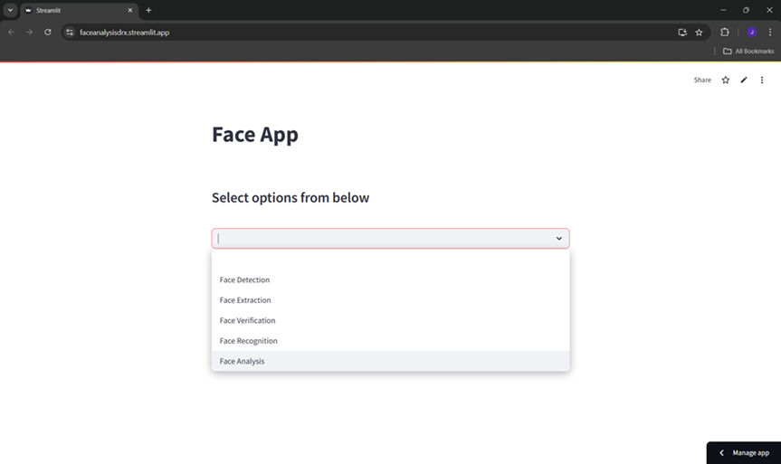
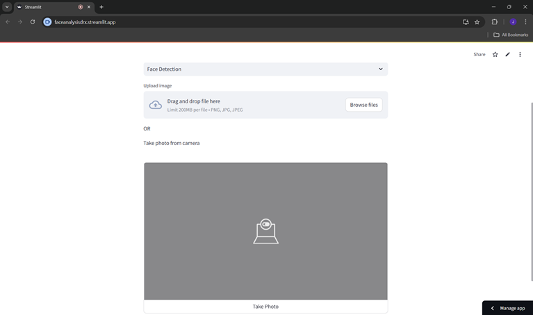
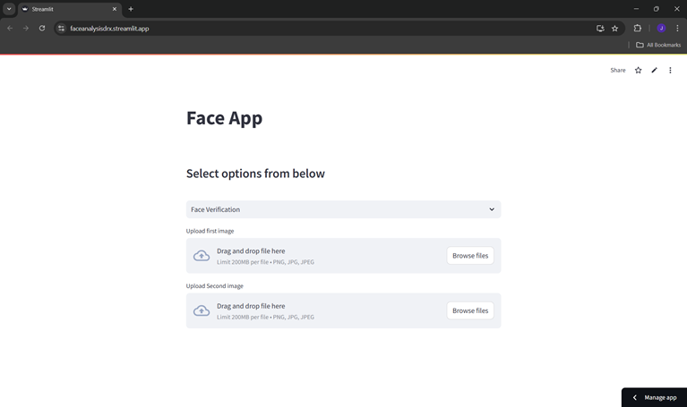

# Face Analysis App using Streamlit

A Streamlit-based application for performing various face-related tasks such as **detection**, **extraction**, **verification**, **recognition**, and **analysis** using [**MTCNN**](https://github.com/ipazc/mtcnn) and [**DeepFace**](https://github.com/serengil/deepface).

## Features

1. **Face Detection**: Detect faces in an uploaded or captured image and display them with bounding boxes.
2. **Face Extraction**: Extract individual faces from an uploaded or captured image.
3. **Face Verification**: Verify whether two faces belong to the same person.
4. **Face Recognition**: Identify and match a face from the uploaded image with a database of faces.
5. **Face Analysis**: Analyze facial attributes such as age and gender.


## Installation
### Prerequisites
Ensure you have Python installed (version **3.8** or later).

### Clone the repository:
```bash
   git clone https://github.com/jaymoundekar18/Face_Analysis_WebApp
```

### Install Required Libraries

- Required libraries: 
  - Streamlit
  - OpenCV
  - Pillow
  - NumPy
  - MTCNN
  - DeepFace
  - Plotly

All dependencies listed in the requirements.txt file. Use the following command:
   ```python
      python -m pip install -r requirements.txt
   ```
### Update or create a dataset
**Note**: The images in dataset should be as shown below:
```
  Face_Analysis_WebApp/
        └── web_facedetection.py
        └── desktopApp.py
        └── requirements.txt
        └── Dataset/
              └── Person_1/
                    └──person_1.jpg
              └── Person_2/
                    └──person_2.jpg
              └── Person_3/
                    └──person_3.jpg
              .
              .
              .
              └── Person_n/
                    └──person_n.jpg  
  ```

### To Run the Streamlit App
1. Open the command prompt or terminal and go to the project directory:
   ```bash
      cd Face_Analysis_WebApp
   ```
2. Run the application script:
   ```bash
      streamlit run web_facedetection.py
   ```
3. After running the above code you will get two url in the terminal like this:
   ```
      Local URL: http://localhost:8501
      Network URL: http://192.168.0.12:8501
   ```
  Open the ```Local URL: http://localhost:8501``` in your browser the application will be running there.

# If you encounter any issues while running the app, you can visit my [hosted app](https://faceanalysisdrx.streamlit.app/).

#### You can also run the desktop version of this app:
  ```bash
       python desktopApp.py
  ```

## Face Web App UI 

**Home Page**<br>


Face Detection          |  Face Verification
:-------------------------:|:-------------------------:
   |  

 Face Recognition          |  Face Analysis on Image
:-------------------------:|:-------------------------:
  |  


## Usage
- **Start the App**: After launching, you'll see the application interface with various options.
- **Choose a Feature**: Select an option (e.g., Face Detection, Face Verification) from the dropdown menu.
- **Upload an Image or Use Camera**:
    - Use the file uploader to upload images (.png, .jpg, .jpeg).
    - Alternatively, take a photo using your webcam.
- **View Results**: The results (e.g., bounding boxes, extracted faces, or analysis) will be displayed in the app.

## Application Workflow
- **Face Detection**: Draws bounding boxes around detected faces using MTCNN.
- **Face Extraction**: Crops out the detected faces and displays them.
- **Face Verification**: Compares two images and determines if they belong to the same individual.
- **Face Recognition**: Matches an uploaded face with a database and returns the names of matching identities.
- **Face Analysis**: Provides insights into attributes like age, emotion, face confidence, race and gender.

## Used Module Overview
- **Streamlit** for the interactive UI.
- **MTCNN** from facenet-pytorch for face detection.
- **DeepFace** for face verification, recognition, and analysis.
- **OpenCV** and **Pillow** for image processing.


## Important Note
- Ensure the Dataset directory is correctly populated for face recognition.
- This app uses the `facenet-pytorch` library for **MTCNN** face detection and `deepface` for **face verification**, **recognition**, and **analysis**.


## License
This project is licensed under the MIT License. Feel free to use and modify it as needed
